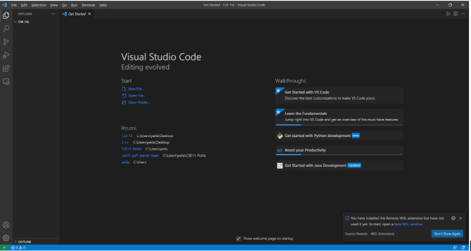
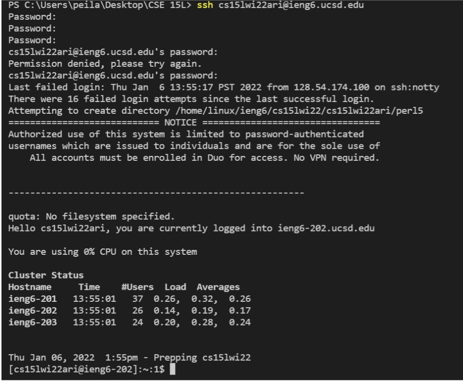
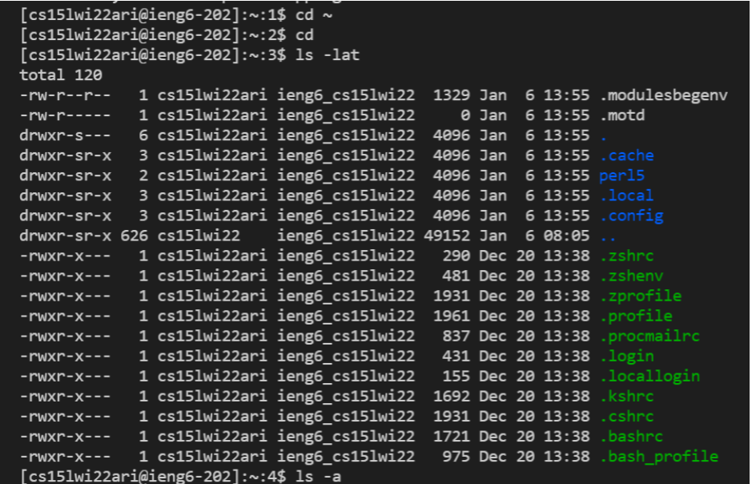
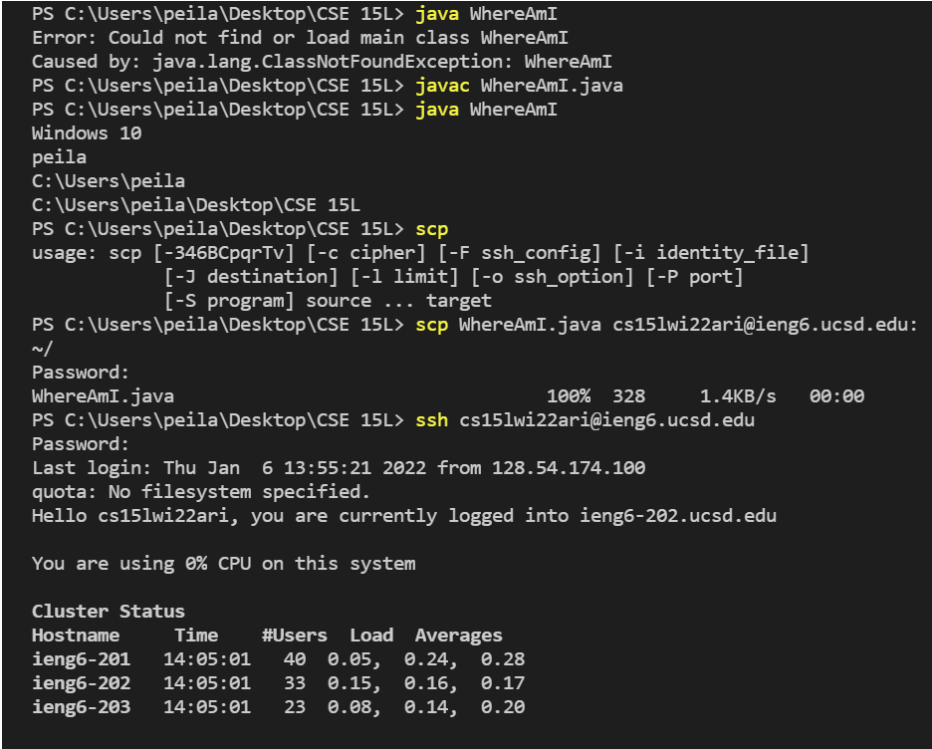
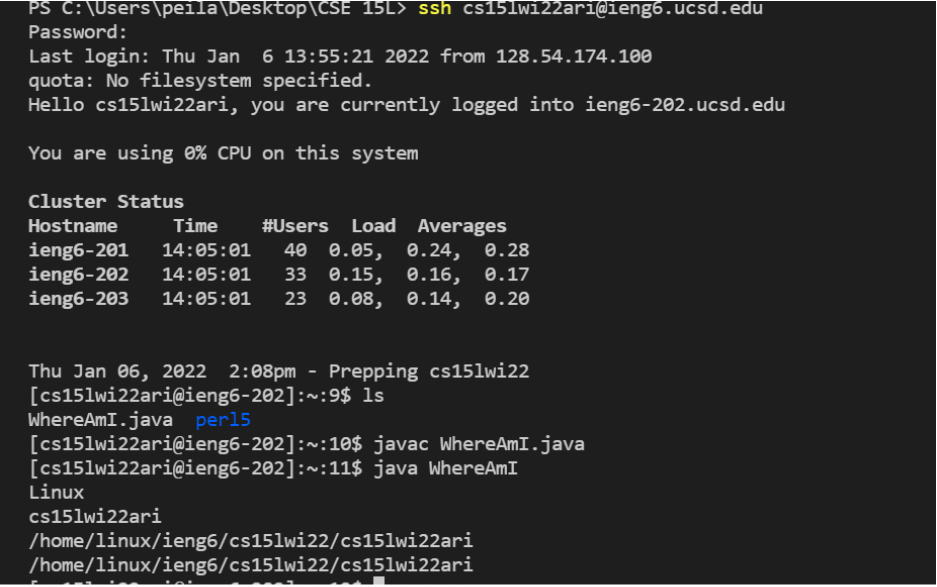
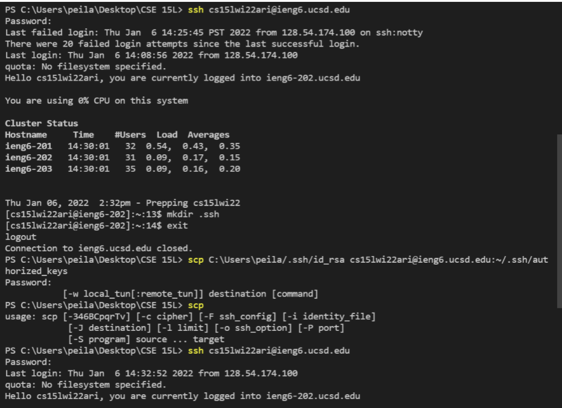
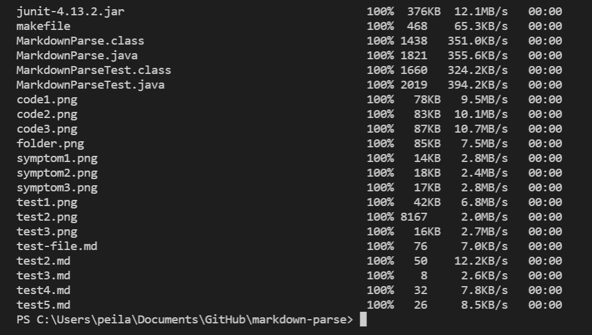
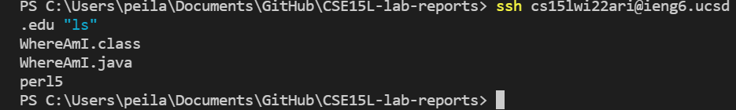
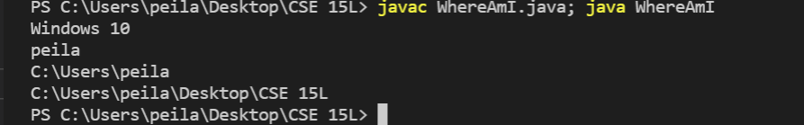

# Week 2 Lab Report
## Tutorial for incoming 15L students

>**How to log into a course-specific account on ieng6**

### Part 1. Installing VScode
 To start, I went to [VScode](https://code.visualstudio.com/) to download VScode on my laptop. 
 It only took a few seconds. Then I just opened my VScode and it should be something like this. 
  I also created a new folder called cse15L so I know where my files are.
 
  
  <br/>
  
### Part 2. Remotely Connecting
  After setting up my VScode, I installed a program called [OpenSSH](https://docs.microsoft.com/en-us/windows-server/administration/openssh/openssh_install_firstuse) 
  since I'm on Windows. Then I looked up my [course-specific account](https://sdacs.ucsd.edu/~icc/index.php) 
  for CSE15L and changed my password for my course-specific account so I could use it after. It took up to 5
  minutes to refresh the password. I followed the reference to [connect to a remote host](https://code.visualstudio.com/docs/remote/ssh#_connect-to-a-remote-host). 
  Then I typed the following code ```$ ssh cs15lwi22zz@ieng6.ucsd.edu``` in my terminal, 
  where zz should be my username, and typed ```yes``` and pressed enter.
  
  
  <br/>
  
### Part 3. Trying Some Commands
   After connecting to a remote host, I tried some specific useful commands:
   ```cd~```, stands for "change directory"
   
   ```cd```
   
   ```ls -lat```, long listing all files (including hidden files) in the order of last time modified
   
   ```ls -a```
   
   ```ls <directory>```, and ```<directory>``` is ```/home/linux/ieng6/cs15lwi22abc```, where ```abc``` is
   one of the other group members' username
   > To log out of the remote server in the terminal, I just typed ```Ctrl-D``` or ran the command ```exit```.

   
   
   
   <br/>
     
### Part 4. Moving Files with scp
   
   In this part, I used the command ```scp``` to copy a file (or many files) from my laptop to a remote computer, 
    which will aways run it from the client (Reminder: it's from my computer, not logged into ```ieng6```). I created
    a file on my computer ```WhereAmI.java``` and put the following codes into it:
    
    class WhereAmI {
      public static void main(String[] args) {
          System.out.println(System.getProperty("os.name"));
          System.out.println(System.getProperty("user.name"));
          System.out.println(System.getProperty("user.home"));
          System.out.println(System.getProperty("user.dir"));
        }
      }
   
   Then I ran ```javac``` and ```java``` on my computer; after that, I ran this following command in the terminal
   from the directory where I made the file:
   
    scp WhereAmI.java cs15lwi22zz@ieng6.ucsd.edu:~/
   
   I was prompted for a password just like what I did when I logged in with ```ssh```. Then, I was able to log into ieng6
   with ssh again, and I used ```ls``` and saw the file in my home directory, which is cool. After this step, 
   I was able to run it on ieng6 computer by using ```javac``` and ```java```. 
   
   
   
   
   
   <br/>
   
   
### Part 5. Setting an SSH Key
   We don't need to type in our password to log into ieng6 if we do the following steps. At first, I run
    the following commands in my terminal:
    
        # on client (your computer)
        $ ssh-keygen
        Generating public/private rsa key pair.
        Enter file in which to save the key (/Users/joe/.ssh/id_rsa): /Users/joe/.ssh/id_rsa
        Enter passphrase (empty for no passphrase): 
        Enter same passphrase again: 
        Your identification has been saved in /Users/joe/.ssh/id_rsa.
        Your public key has been saved in /Users/joe/.ssh/id_rsa.pub.
        The key fingerprint is:
        SHA256:jZaZH6fI8E2I1D35hnvGeBePQ4ELOf2Ge+G0XknoXp0 joe@Joes-Mac-mini.local
        The key's randomart image is:
        +---[RSA 3072]----+
        |                 |
        |       . . + .   |
        |      . . B o .  |
        |     . . B * +.. |
        |      o S = *.B. |
        |       = = O.*.*+|
        |        + * *.BE+|
        |           +.+.o |
        |             ..  |
        +----[SHA256]-----+
    
  This step created two new files on my system: the private key, which is in a file ```id_rsa```;
     and the public key, which is in a file ```id_rsa.pub```, stored in the ```.ssh``` directory on
     my computer. Then, I typed the following commands in my terminal (shown in my screenshot):
  > I was required to typed in my password to confirm before I could use the ssh without typing my
  > password everytime in the future.
     

   
   
   
   <br/>
   
### Part 6. Optimizing Remote Running
   I ran multiple commands at the same time in this part. By using semicolons to run multiple commands,
    it saved me some time while running all the codes. Besides, by adding ```ls``` immediately after the command
    of ```ssh```, I was able to get the ```ls``` immediately without waiting to log in and then typing the command
    after.
   >In this part, we were just coming up with more clever and time saving process to run the commands.


  
  
   
   
   
### By Catherine Chen

### 1/13/2022 :)
   
