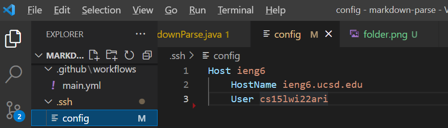
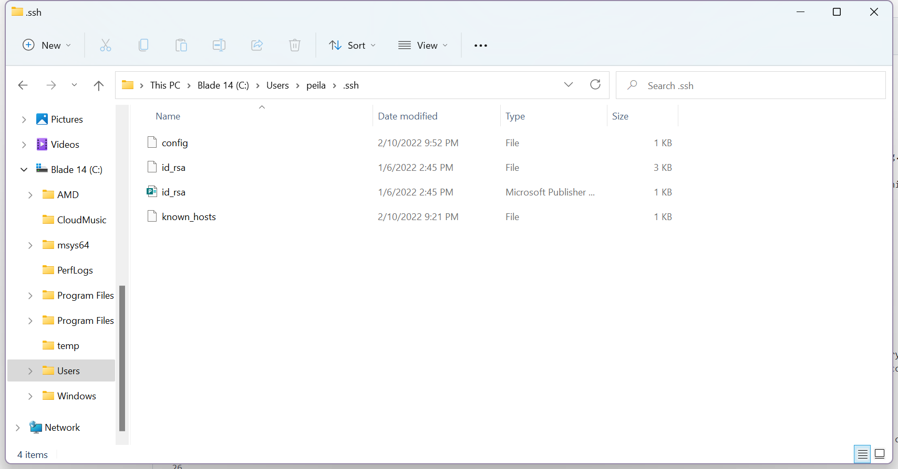
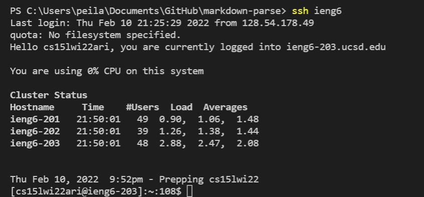
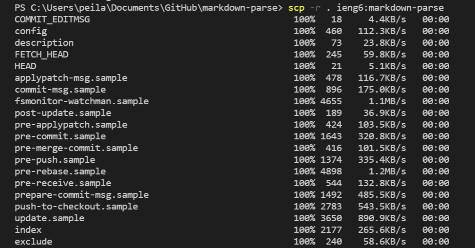

# Lab Report 3 - Week 6
## Choice 1. Streamling ssh Configuration

### **How to Streamline ssh Configuration**

When we log into ieng6 fromm our laptop, we usually type: ```$ ssh cs15lwi22zzz@ieng6.ucsd.edu```.

However, it is too long and it's complicated. In this part, we are trying to use some configuration files that can save us some typing. Here are some steps:

## Step 1

I put an entry in ```~/.ssh/config``` that tells SSH what username to use when logging into specific servers, and even give servers nicknames.
I created the ```config``` file from VSCode and then I dragged it into my ```.ssh``` folder.



</br>

## Step 2

After opening ```~/.ssh/config```, add these following lines. Here's what I put in my ```config``` file. You can change ```ieng6``` after ```Host``` to another name if you like; it’s an alias you are inventing for ```ssh``` to interpret.
```
Host ieng6
    HostName ieng6.ucsd.edu
    User cs15lwi22zzz (use your username)
```


</br>

## Step 3

After having the ```config``` file ready, I tried the following command. Then I was able to log into my account.
```
ssh ieng6
```


</br>

## Step 4

Here's an scp command copying a file to my account using just the alias ```ieng6``` that I chose. Here I chose to copy from ```markdown-parse``` and I'm able to only type my alias ```ieng6``` without typing a long command.




</br>

### By Catherine Chen

### 2/10/2022
