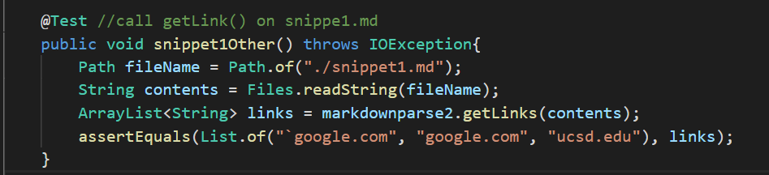
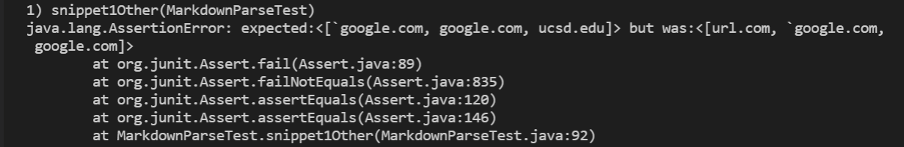
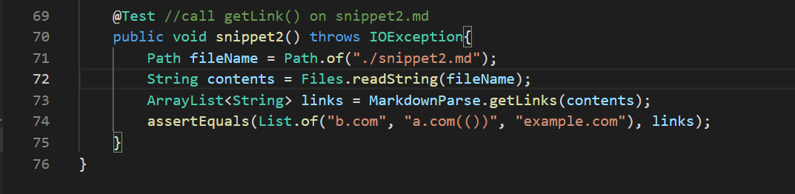
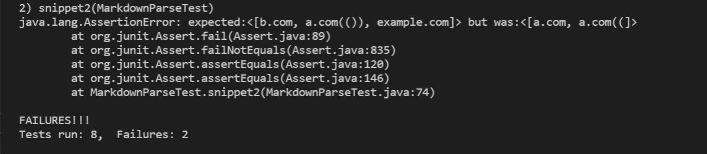
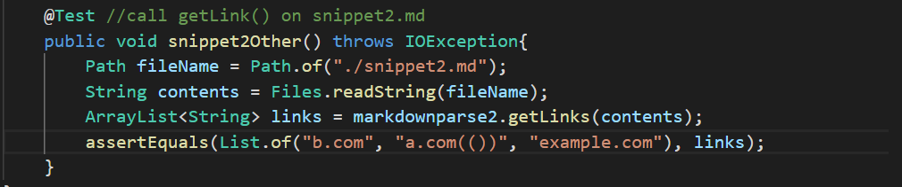
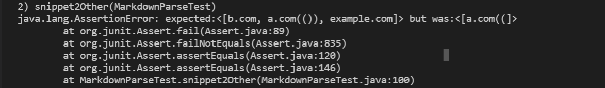
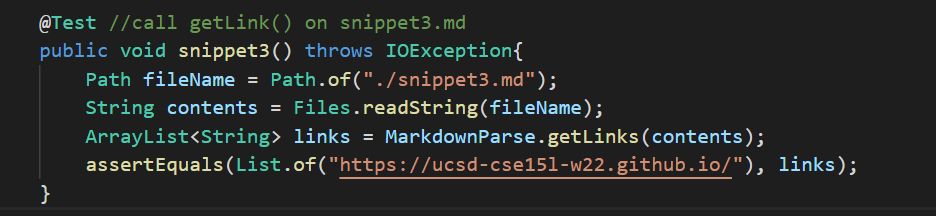
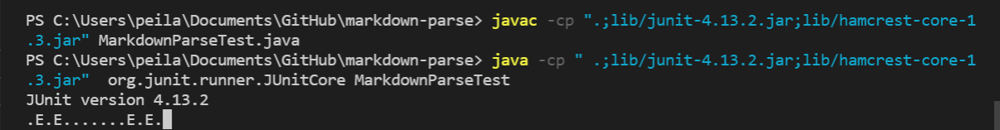
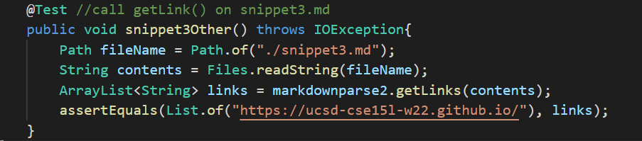
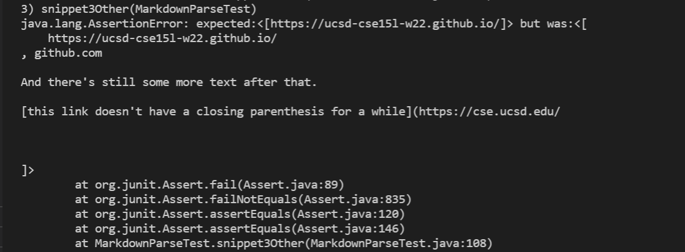

# Week 8 Lab Report 4
Here's [my MarkdownParse repository](https://github.com/CATHCHEN014/markdown-parse)
to and here's the [MarkdownParse repository we reviewed](https://github.com/sallada1/markdown-parse).

## Snippet 1
```
`[a link`](url.com)

[another link](`google.com)`

[`cod[e`](google.com)

[`code]`](ucsd.edu)
```
For this snippet, the correct output should be ```google.com```, 
```google.com```, and ```ucsd.edu``` since they are the only three 
valid link that could be clicked on when I checked on 
[the CommonMark demo site](https://spec.commonmark.org/dingus/).

Here is how I turned it into a test in ```MarkdownParseTest.java```.


### Test for my MarkdownParse
My ```MarkdownParse.java``` failed the test as I ran the JUnit test.


**Possible changes to make it pass**

I think if I add two more if statement within the getLinks() method, it can 
actually work. First, I can add an if statement to check whether ```[``` appears 
at the start of the line - if there's any special characters, such as ``` ` ```, 
then it shouldn't be a valid link output. Second, I can add an if statement to check 
if there's another ```]``` after the first ```]``` - if there is another ```]``` after the first 
```]```, then nextCloseBracket should be reset to the close bracket that appears last.

### Test for the other group's MarkdownParse
Here's the test for the other group's ```MarkdownParse.java```.


And they also failed for the same reason as our group has.



<br/>

## Snippet 2
```
[a [nested link](a.com)](b.com)

[a nested parenthesized url](a.com(()))

[some escaped \[ brackets \]](example.com)
```
For this snippet, the correct output should be ```b.com```, 
```a.com(())```, and ```example.com``` since they are the only three 
valid link that could be clicked on when I checked on 
[the CommonMark demo site](https://spec.commonmark.org/dingus/).

Here is how I turned it into a test in ```MarkdownParseTest.java```.


### Test for my MarkdownParse
My ```MarkdownParse.java``` failed the test as I ran the JUnit test.


**Possible changes to make it pass**

Similar to the problem in ```snippet1```, I can add an if statement to check 
if there's another ```]``` or ```)``` after the first ```]``` 
or ```)``` - if there is another ```]``` or ```)``` after the first 
```]``` or ```)```, then nextCloseBracket or the nextCloseParen 
should be reset to the close bracket or parenthesis that appears last - 
to include the whole correct link within the open parenthesis and the close parenthesis.
If my code is able to check for the correct close bracket and close parenthesis, ```snippet2``` 
will be okay to pass since it seems like ```snippet2``` mainly tests on close parenthesis and 
close brackets.

### Test for the other group's MarkdownParse
Here's the test for the other group's ```MarkdownParse.java```.


And they also failed for a similar reason as our group has.


<br/>

## Snippet 3
```
[this title text is really long and takes up more than 
one line

and has some line breaks](
    https://www.twitter.com
)

[this title text is really long and takes up more than 
one line](
    https://ucsd-cse15l-w22.github.io/
)


[this link doesn't have a closing parenthesis](github.com

And there's still some more text after that.

[this link doesn't have a closing parenthesis for a while](https://cse.ucsd.edu/


)

And then there's more text
```

For this snippet, the correct output should be ```https://ucsd-cse15l-w22.github.io/``` 
since it is the only valid link that could be clicked on when I checked on 
[the CommonMark demo site](https://spec.commonmark.org/dingus/).

Here is how I turned it into a test in ```MarkdownParseTest.java```.


### Test for my MarkdownParse
My ```MarkdownParse.java``` failed the test as I ran the JUnit test.


**Possible changes to make it pass**


### Test for the other group's MarkdownParse
Here's the test for the other group's ```MarkdownParse.java```.


They also failed ```snippet3```.



<br/>

### Catherine Chen
### 2/24/2022
