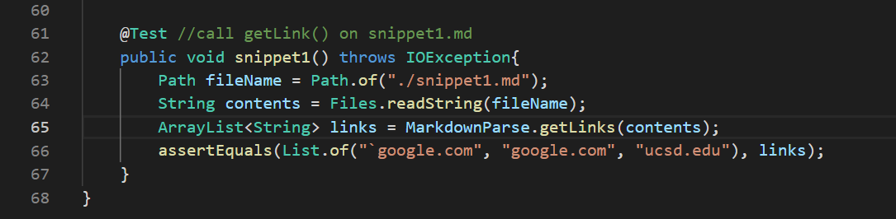
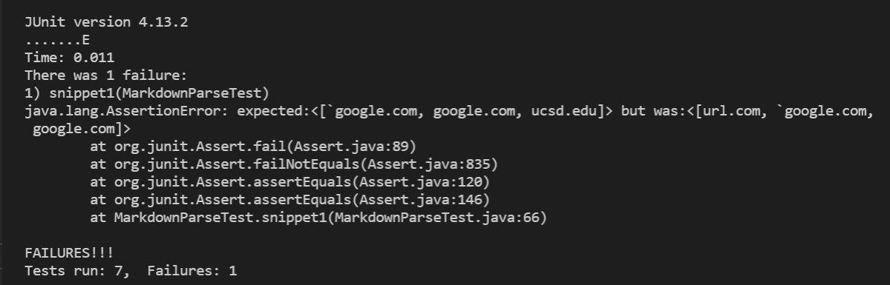

# Week 8 Lab Report 4
Here's [my MarkdownParse repository](https://github.com/CATHCHEN014/markdown-parse)
to and here's the [MarkdownParse repository we reviewed](https://github.com/sallada1/markdown-parse).

## Snippet 1
```
`[a link`](url.com)

[another link](`google.com)`

[`cod[e`](google.com)

[`code]`](ucsd.edu)
```
For this snippet, the correct output should be ```google.com```, 
```google.com```, and ```ucsd.edu``` since they are the only three 
valid link that could be clicked on when I checked on 
[the CommonMark demo site](https://spec.commonmark.org/dingus/).

Here is how I turned it into a test in ```MarkdownParseTest.java```.

### Test for my MarkdownParse
My ```MarkdownParse.java``` failed the test as I ran the JUnit test.



### Test for the other group's MarkdownParse


<br/>

Your report should include:

A link to your markdown-parse repository and a link to the one you reviewed

For each test above:

Decide on what it should produce by using either VScode preview or the CommonMark demo site

Showing the code in MarkdownParseTest.java for how you turned it into a test

For your implementation, the corresponding output when running the tests; if it passed, say so. 

If it didn’t pass, show the specific part of the JUnit output that shows the test failure.
For the implementation you reviewed, the corresponding output when running the tests; 
if it passed, 
say so. If it didn’t pass, show the specific part of the JUnit output that shows the test failure.
Answer the following questions with 2-3 sentences each:
Do you think there is a small (<10 lines) code change that will make your program work for snippet 1 and 
all related cases that use inline code with backticks? If yes, describe the code change. If not, describe why it would be a more involved change.

## Snippet 2
```
[a [nested link](a.com)](b.com)

[a nested parenthesized url](a.com(()))

[some escaped \[ brackets \]](example.com)
```

<br/>

## Snippet 3
```
[this title text is really long and takes up more than 
one line

and has some line breaks](
    https://www.twitter.com
)

[this title text is really long and takes up more than 
one line](
    https://ucsd-cse15l-w22.github.io/
)


[this link doesn't have a closing parenthesis](github.com

And there's still some more text after that.

[this link doesn't have a closing parenthesis for a while](https://cse.ucsd.edu/


)

And then there's more text
```

Your report should include:

A link to your markdown-parse repository and a link to the one you reviewed

For each test above:

Decide on what it should produce by using either VScode preview or the CommonMark demo site

Showing the code in MarkdownParseTest.java for how you turned it into a test

For your implementation, the corresponding output when running the tests; if it passed, say so. 

If it didn’t pass, show the specific part of the JUnit output that shows the test failure.
For the implementation you reviewed, the corresponding output when running the tests; if it passed, 
say so. If it didn’t pass, show the specific part of the JUnit output that shows the test failure.
Answer the following questions with 2-3 sentences each:
Do you think there is a small (<10 lines) code change that will make your program work for snippet 1 and 
all related cases that use inline code with backticks? If yes, describe the code change. If not, describe why it would be a more involved change.
Do you think there is a small (<10 lines) code change that will make your program work for snippet 2 and 
all related cases that nest parentheses, brackets, and escaped brackets? If yes, describe the code change.
If not, describe why it would be a more involved change.
Do you think there is a small (<10 lines) code change that will make your program work for snippet 3 and 
all related cases that have newlines in brackets and parentheses? If yes, describe the code change. If not, describe why it would be a more involved change.
