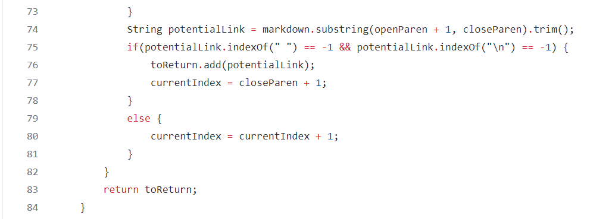

# Week 10 Lab Report 5

## Explaination:

In my group, we first git clone the repolink of 
the lastest version of code for ```MarkdownParse.java``` and 
other tests files in the joe's [markdown-parse](https://github.com/ucsd-cse15l-w22/markdown-parse) 
repository on ```ieng6```. Then we run ```make``` and run ```time bash script.sh``` in this repo. Then we added some code in 
```script.sh``` to print out the name of each test file before its output. 
Then we saved the output to a file using output redirection by using the 
command ```bash script.sh > results.txt```. Then we copied ```script.sh``` to our repository and 
did similar steps to get the output file for [our repository](https://github.com/m1ma0314/markdown-parse). 
I found the tests with different results by using diff on the results of 
running a bash for loop. We didn't search through manually or other programmatic idea.


## First Test with Different Answers
Here is one test that I found from my ```resultsDiffs.txt```. By using ```vim``` and ```:set number```, 
I was able to locate the line number with the tests.


The test content is:


Here is the output of our repo:


And here is the output of joe's repo:


```
Difference #1: test-files/510.md
Test file contents:[link] (/uri)
Student output: []
Joe output: [/uri]
expected output: []
Correct implementation: Mijia’s repo
```
Here is one of the difference that we found during lab 9. For ```510.md```, our group's 
code will get an empty output while Joe's code will give us ```[/uri]```. I think our group 
provides the correct result since when we put the test file content ```[link] (/uri)``` into 
[commonmark website](https://spec.commonmark.org/dingus/), it is not a link that we can click on. 
The bug in Joe's code is that it doesn't check whether there is a ``` ``` (white space) between 
close bracket and open parenthesis, so it prints out a result which is not an actual link.

### Code to be Fixed
Here's the code from Joe's repository. Before adding the ```potentialLink``` to the ```toReturn``` 
ArrayList, it should check whether the ```closeBracket``` is just one index before ```openParen``` to 
make sure there is no white space in between.



<br/>

## Second Test with Different Answers
Here is another test that I found from my ```resultsDiffs.txt```. By using ```vim``` and ```:set number```, 
I was able to locate the line number with the tests.


The test content is:


Here is the output of our repo:


And here is the output of joe's repo:


```
Difference #2: test-files/490.md
Test file contents:[link](<foo
bar>)
Student output:[link](<foo
bar>)
Joe output:[]
expected output: []
Correct implementation: Joe’s repo
```
Here is the other different results that we found during lab 9. For ```490.md```, 
I think joe's repo provides the correct output since when we put the test file content 
```
[link](<foo
bar>)
``` 
into [commonmark website](https://spec.commonmark.org/dingus/), it is not a link that we can click on. 


### Code to be fixed
The bug in our code is that it fails to check when the content within the ```openParen``` and 
```closeParen``` is in the same line. Since it is missing the condition to check this error of 
a link, it prints out a link which is not an actual link since it is not on the same line.a


Here is the code that we should fix. Before adding the link to ```toReturn``` ArrayList, we should 
have an if statement to check whether the ```openParen``` and ```closeParen``` are on the same line. 
If they are not on the same line, then the context withn the parenthesis should not be added.

<br/>

### Catherine Chen
### 3/10/2022
